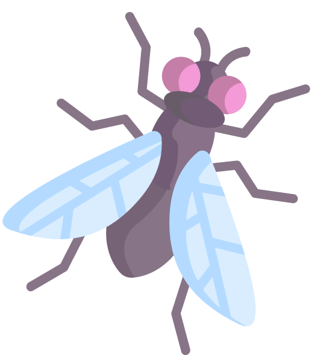

  
  <h1>Reaction</h1>
  
  

    This web app is an aim trainer game where the user can test and improve their speed and reaction time. The user can also create an account, allowing them to keep track of their game statistics over the long term.
  

  <a style='font-size: 15px' href='https://reaction-chi.vercel.app/Play'> View Site </a>
  · 
  <a style='font-size: 15px' href='https://github.com/michaelgreenl/reaction/issues'>Report Issue</a>

### Technologies Used

[![React.js]][React-url] [![Node.js]][Node-url] [![Express.js]][Express-url] [![MySQL]][MySQL-url] [![AWS]][AWS-url]

### Repositories

- Frontend: [https://github.com/michaelgreenl/reaction](https://github.com/michaelgreenl/reaction)
- API: [https://github.com/michaelgreenl/reaction-api](https://github.com/michaelgreenl/reaction-api)

### Contact

- Email: [@greenmichael5000@gmail.com](@greenmichael5000@gmail.com)
- LinkedIn: [https://www.linkedin.com/in/michaelgreen5/](https://www.linkedin.com/in/michaelgreen5/)

[gmail-url]: @greenmichael5000@gmail.com
[gmail]: https://skillicons.dev/icons?i=gmail
[linkedIn-url]: https://www.linkedin.com/in/michaelgreen5/
[linkedIn]: https://skillicons.dev/icons?i=linkedin
[screenshot-url]: public/assets/images/readme-screenshot.png
[React.js]: https://skillicons.dev/icons?i=react
[React-url]: https://reactjs.org/
[Node.js]: https://skillicons.dev/icons?i=nodejs
[Node-url]: https://nodejs.org/docs/latest/api/
[Express.js]: https://skillicons.dev/icons?i=express
[Express-url]: https://expressjs.com/
[MySQL]: https://skillicons.dev/icons?i=mysql
[MySQL-url]: https://dev.mysql.com/doc/
[AWS]: https://skillicons.dev/icons?i=aws
[AWS-url]: https://docs.aws.amazon.com/rds/
[github]: https://skillicons.dev/icons?i=github
